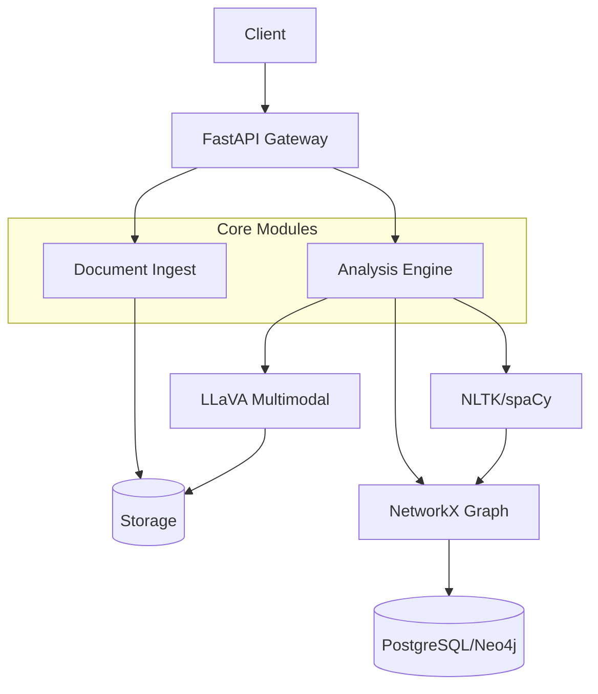

# CivicSentinel — Production Guide

Deploy and operate the public policy analysis system in production.

## Architecture



Components:
- **API** (`src/civic_sentinel/main.py`) — FastAPI gateway with health, metrics, logging
- **Routers**: Documents (upload/list), Analysis (pipeline trigger)
- **Services**: LLaVA analysis, NLP pipeline, Graph builder
- **Store**: In-memory for MVP; upgrade to SQLAlchemy + PostgreSQL

---

## Deployment

### Docker Compose (recommended)

```bash
git clone https://github.com/GBOYEE/civic-sentinel.git
cd civic-sentinel
docker-compose up -d
```

API runs on http://localhost:8000

Enable Postgres by uncommenting profile in compose file.

### VPS (systemd)

```ini
[Unit]
Description=CivicSentinel API
After=network.target

[Service]
Type=simple
User=civic
WorkingDirectory=/opt/civic-sentinel
Environment="CIVIC_ENV=production"
Environment="DATABASE_URL=sqlite:///data/civic.db"
ExecStart=/opt/civic-sentinel/.venv/bin/uvicorn src.civic_sentinel.main:app --host 127.0.0.1 --port 8000
Restart=on-failure

[Install]
WantedBy=multi-user.target
```

---

## Configuration

| Variable | Default | Description |
|----------|---------|-------------|
| `CIVIC_ENV` | `production` | `development` enables reload |
| `CIVIC_PORT` | `8000` | Server port |
| `DATABASE_URL` | `sqlite:///data/civic.db` | Database |
| `OLLAMA_HOST` | `http://localhost:11434` | LLaVA service |
| `OPENAI_API_KEY` | *(optional)* | Fallback LLM |

---

## Observability

- **Health**: `GET /health` returns `{status, timestamp, version, environment}`
- **Metrics**: `GET /metrics` returns `{requests_total, requests_failed, documents_uploaded, analyses_run}` (counters)
- **Logging**: Structured logs to stdout; set `LOG_LEVEL=INFO` or `DEBUG`

---

## API Reference

| Endpoint | Method | Description |
|----------|--------|-------------|
| `/api/v1/documents` | POST | Upload document (multipart/form-data) |
| `/api/v1/documents` | GET | List all documents |
| `/api/v1/documents/{id}` | GET | Get document metadata |
| `/api/v1/analyze/{doc_id}` | POST | Run analysis pipeline |
| `/api/v1/analysis/{analysis_id}` | GET | Get analysis results |
| `/graph/entities` | GET | List knowledge graph entities |

---

## Testing

```bash
pip install -e .[dev]
pytest tests/ -v
mypy src/civic_sentinel --ignore-missing-imports
```

---

## Security Notes

- LLaVA calls are local (Ollama); no external API usage
- Document uploads stored to `data/uploads`; ensure disk quota
- Authentication not implemented yet — consider adding API key for production
- Use HTTPS reverse proxy (Nginx) in production

---

## Roadmap

- [ ] Persistent storage (SQLAlchemy + PostgreSQL)
- [ ] Full LLaVA integration (image extraction + prompts)
- [ ] Entity relation extraction (NLP)
- [ ] Knowledge graph query API (Cypher)
- [ ] Role-based access control
- [ ] Background task queue (Celery/Arq)
- [ ] Admin dashboard (Streamlit)

---

## License

MIT — see `LICENSE`.
