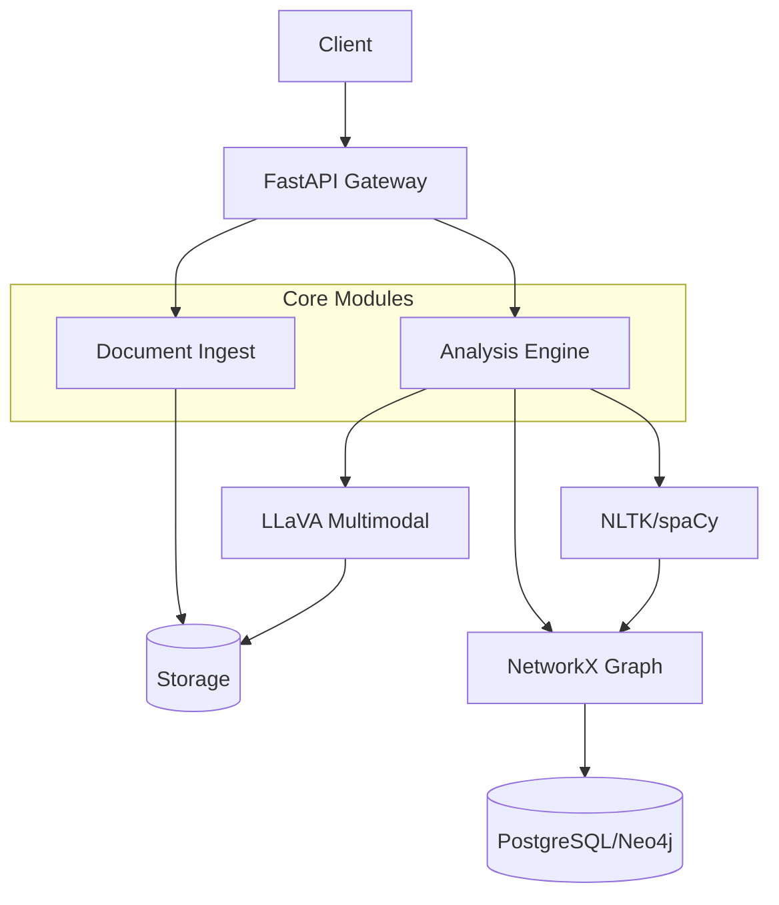

# CivicSentinel 🏛️

AI-powered public policy analysis system. Processes civic documents, extracts entities, builds knowledge graphs, and generates alignment reports.

[](.github/workflows/ci.yml)
[](LICENSE)

---

## Features

- **Document Ingestion** — Upload PDF/HTML civic documents (bills, policies)
- **Multimodal AI** — LLaVA integration for image+text analysis
- **NLP Pipeline** — NLTK/spaCy for entity extraction, summarization
- **Knowledge Graph** — NetworkX builds relationships between entities
- **Alignment Reports** — Compare policy against goals/NGSS
- **Observability** — Health checks, metrics, structured logging
- **Production Ready** — Docker, CI, pre-commit hooks

---

## Quick Start

```bash
# Clone and install
git clone https://github.com/GBOYEE/civic-sentinel.git
cd civic-sentinel
python -m venv .venv && source .venv/bin/activate
pip install -e .[dev]

# Run API
CIVIC_ENV=development uvicorn src.civic_sentinel.main:app --reload

# Open http://localhost:8000/docs
```

---

## Architecture



See [Production Guide](README-PRODUCTION.md) for details.

---

## Environment Variables

| Variable | Default | Description |
|----------|---------|-------------|
| `CIVIC_ENV` | `development` | `production` disables reload |
| `CIVIC_PORT` | `8000` | Server port |
| `DATABASE_URL` | `sqlite:///data/civic.db` | Database |
| `OLLAMA_HOST` | `http://localhost:11434` | LLaVA via Ollama |
| `OPENAI_API_KEY` | *(optional)* | For GPT-4 fallback |

---

## API Endpoints

| Method | Endpoint | Description |
|--------|----------|-------------|
| `POST` | `/api/v1/documents` | Upload document (PDF/HTML) |
| `GET` | `/api/v1/documents` | List documents |
| `GET` | `/api/v1/documents/{id}/analysis` | Get analysis results |
| `POST` | `/api/v1/analyze` | Trigger analysis on existing doc |
| `GET` | `/graph/entities` | Query knowledge graph |

---

## Development

```bash
# Pre-commit hooks
pre-commit install

# Tests
pytest tests/ -v

# Type check
mypy src/civic_sentinel
```

---

## Deployment

- **Docker**: `docker-compose up -d`
- **Kubernetes**: See `k8s/` manifest (future)
- **VPS**: Systemd unit (see README-PRODUCTION.md)

Full guide: [README-PRODUCTION.md](README-PRODUCTION.md)

---

## License

MIT — see [LICENSE](LICENSE).
